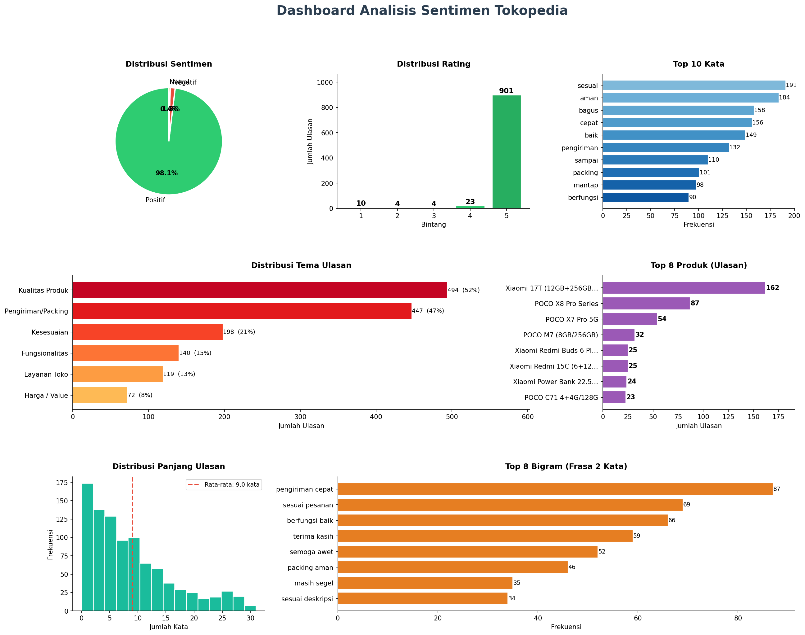

# 🛒 Reading the Reviews: Turning Tokopedia Customer Feedback into Business Intelligence with Python

> Transforming **942 unstructured customer reviews** from Indonesia's largest marketplace into a structured view of customer sentiment, operational performance, and reputation drivers — answering not just *whether* customers are satisfied, but *why*.


[📖 Read the full article on Medium](https://medium.com/@raihanmasyalhaidar/reading-the-reviews-turning-tokopedia-customer-feedback-into-business-intelligence-with-python-4905a9518f4c)

---

## 📌 Overview

Every e-commerce store already knows **what** it sold — revenue, order volume, conversion rates, and best-sellers are all measured precisely. Yet these metrics rarely explain **why** customers are satisfied, loyal, or disappointed. That reasoning lives in a less structured place: **customer reviews**.

This project builds an end-to-end **voice-of-customer analytics** workflow that collects, cleans, classifies, and analyzes **942 customer reviews covering 139 products** from the official Xiaomi store on Tokopedia. Using a custom Selenium scraper plus a transparent, rule-based NLP pipeline, it answers a single fundamental question:

> *What can customer reviews tell us about the factors that strengthen or weaken customer trust in an e-commerce store?*

The headline picture is a **strong but operationally-driven reputation**: **98.1% positive** sentiment and an average rating of **4.91 / 5**, where satisfaction rests on two pillars — **confidence in the product** and **confidence in the fulfillment process**. The store's rare failures are concentrated not in product quality, but in **packaging damage, last-mile courier issues, and isolated listing/service gaps**.

> All reviews are publicly visible customer feedback. The dataset contains no customer identifiers, transaction values, purchase histories, or timestamps.

---

## 🔑 Key Findings

| Theme                    | Finding                                                                                                                            |
| ------------------------ | -------------------------------------------------------------------------------------------------------------------------------- |
| **Overall sentiment**    | **924 (98.1%)** positive, **14 (1.5%)** negative, **4 (0.4%)** neutral — positivity overwhelmingly dominates the corpus           |
| **Rating intensity**     | **901 (95.6%)** of reviews are 5-star; average **4.91 / 5** — satisfaction is *exceptional*, not merely *adequate*                |
| **Top vocabulary**       | `sesuai` (191), `aman` (184), `bagus` (158), `cepat` (156) — **product trust** and **fulfillment trust** appear almost equally    |
| **Theme split**          | **Product Quality (52.4%)** and **Shipping & Packaging (47.5%)** dominate — logistics is discussed *almost as often* as the product |
| **Review concentration** | **Xiaomi 17T (162 reviews)** drives nearly 2× the next product (POCO X8 Pro Series, 87) — reputational exposure is concentrated     |
| **Communication style**  | Median review is **7 words** (avg 9) — customers summarize satisfaction *concisely*                                                |
| **Top bigrams**          | `pengiriman cepat` (87), `sesuai pesanan` (69), `berfungsi baik` (66) — complete customer statements about speed, accuracy, function |
| **Where it breaks (1.5%)** | Negative reviews cluster around **packaging damage on flagships**, **courier/last-mile delays**, and **listing/service gaps**     |

---

## 🗂️ Table of Contents

- [Business Problem](#-business-problem)
- [Dataset](#-dataset)
- [Methodology](#-methodology)
- [Analysis Highlights](#-analysis-highlights)
- [Reading the 1.5%](#-reading-the-15-where-experience-breaks-down)
- [Business Recommendations](#-business-recommendations)
- [Project Structure](#-project-structure)
- [Tech Stack](#️-tech-stack)
- [Reproduce This Analysis](#️-reproduce-this-analysis)
- [Limitations & Future Work](#-limitations--future-work)
- [Read More](#-read-more)
- [License](#-license)

---

## 🎯 Business Problem

Established marketplace sellers already track units sold, revenue, conversion rates, and average ratings. These are excellent for monitoring *outcomes*, but provide limited visibility into the *underlying customer experience*.

Consider a store with a 4.9-star average. The rating signals strong performance, but it does not explain what customers value most, which aspects shape their purchasing decisions, or what occasionally drives dissatisfaction. **Ratings measure outcomes; they do not explain the drivers behind them.**

Customer reviews supply that missing context — but because they are unstructured and scattered across hundreds of comments, extracting patterns at scale is hard. This project tackles that gap through five guiding questions:

1. **Overall sentiment health** — What proportion of customers are satisfied, neutral, or dissatisfied, and how does it align with ratings?
2. **Drivers of satisfaction** — Which themes and expressions appear most in positive reviews?
3. **Sources of dissatisfaction** — When experiences turn negative, what issues recur and where are they concentrated?
4. **Product-level concentration** — Which products generate the most feedback, and where should monitoring focus?
5. **Operational implications** — What packaging, logistics, listing-accuracy, and service actions could strengthen satisfaction and reputation?

---

## 💾 Dataset

Collected directly from the review section of the **official Xiaomi store on Tokopedia**. Each observation is a customer review linked to a specific product and its star rating — naturally occurring feedback, not survey responses.

| Property              | Value                                                  |
| --------------------- | ------------------------------------------------------ |
| Reviews               | **942**                                                |
| Products              | **139**                                                |
| Average rating        | **4.91 / 5**                                           |
| Median review length  | **7 words** (avg 9)                                    |
| Core raw fields       | `Produk`, `Rating` (1–5), `Ulasan`                     |
| Engineered fields     | `Clean_Ulasan`, `Sentiment`, `Word_Count`, `Char_Count`, `Length_Category` |

The raw data is enriched with cleaned text, sentiment labels, word/character counts, and review-length categories. A full field-by-field description lives in [`data/DATA_DICTIONARY.md`](data/DATA_DICTIONARY.md).

> **Scope note:** the analysis reflects a single store at a single point in time, supporting **store-level operational decisions** rather than broad generalizations about Indonesian e-commerce.

---

## 🔬 Methodology

The pipeline turns unstructured feedback into a format suitable for quantitative analysis, with two priorities: **transparency** for non-technical stakeholders and **scalability** across hundreds of reviews. It runs in four stages.

### 1. Data Collection (Web Scraping)
Tokopedia loads reviews dynamically via JavaScript, so plain HTTP requests are insufficient. A custom **Selenium** scraper automates browser navigation, handles dynamic loading, paginates the review list, and extracts three core attributes per review: **Product Name**, **Star Rating (1–5)**, and **Review Text**. Product names are standardized to remove store names, storage variants, and marketing suffixes so the same product family groups correctly.

### 2. Text Preprocessing
Marketplace reviews carry inconsistent capitalization, emojis, abbreviations, and informal language. Cleaning lowercases the text, removes punctuation/special characters and excess whitespace, then strips Indonesian stopwords (`dan`, `yang`, `di`, …) and low-value marketplace terms.

```python
def clean_ulasan(text: str) -> str:
    text = str(text).lower()
    text = re.sub(r'[^a-zA-Z0-9\s]', ' ', text)
    text = re.sub(r'\s+', ' ', text).strip()
    return text
```

### 3. Sentiment Classification
Rather than a pre-trained model, sentiment is derived directly from the customer's own star rating — a transparent, objective signal that aligns with how marketplace ratings are interpreted in practice.

```python
def sentiment_by_rating(rating) -> str:
    if rating >= 4:   return 'Positif'   # 4-5 stars
    elif rating == 3: return 'Netral'    # 3 stars
    else:             return 'Negatif'   # 1-2 stars
```

### 4. Theme Tagging
Sentiment explains *whether* customers are satisfied, not *why*. Reviews are tagged against **six business themes** using a keyword dictionary. Because a single review can mention several aspects, tagging is **multi-label** — preventing valuable signal from being discarded.

| Theme                | Captures                                              |
| -------------------- | ----------------------------------------------------- |
| Kualitas Produk      | Product quality, authenticity, build                  |
| Pengiriman/Packing   | Delivery speed, packaging, safe arrival               |
| Kesesuaian           | Listing accuracy — "as described / as ordered"        |
| Fungsionalitas       | Post-purchase product performance                     |
| Harga / Value        | Price and value perception                            |
| Layanan Toko         | Store service, responsiveness, warranty               |

---

## 📈 Analysis Highlights

The full 7-panel dashboard summarizes sentiment, ratings, vocabulary, themes, product concentration, review length, and recurring phrases.



### Sentiment & Rating
Out of 942 reviews, **924 (98.1%)** are positive and **901 (95.6%)** are 5-star, yielding a **4.91** average. Dissatisfaction is not broadly distributed — it occurs in isolated situations.

### What Customers Talk About
The most frequent meaningful words split into two narratives. **Product trust** — `sesuai` (191), `bagus` (158), `baik` (149), `mantap` (98), `berfungsi` (90). **Fulfillment trust** — `aman` (184), `cepat` (156), `pengiriman` (132), `sampai` (110), `packing` (101). Logistics vocabulary appears *almost as often* as product vocabulary: customers evaluate not only *what* they receive but *how it arrives*.

### Themes
**Product Quality (494 reviews, 52.4%)** and **Shipping & Packaging (447, 47.5%)** sit close together — satisfaction is built on two complementary pillars rather than one.

### Product Concentration
The **Xiaomi 17T (12GB+256GB)** records **162 reviews**, nearly double the **POCO X8 Pro Series (87)** and **POCO X7 Pro 5G (54)**. A small group of flagship products carries a disproportionate share of reputational exposure.

### Recurring Phrases (Bigrams)
`pengiriman cepat` (87), `sesuai pesanan` (69), `berfungsi baik` (66), `terima kasih` (59), `packing aman` (46), `masih segel` (35). Customers consistently describe products that arrive **quickly, safely, as advertised, and in working condition**.

---

## 🔍 Reading the 1.5%: Where Experience Breaks Down

The 14 negative reviews are statistically small but analytically valuable — they reveal where execution fails. Three patterns recur:

1. **Shipping damage on high-value products.** Dented boxes and insufficient protection on flagship devices (especially the Xiaomi 17T). The issue is packaging *consistency* for high-risk items, not packaging quality in general — a damaged flagship is far more likely to trigger a public complaint than a damaged accessory.

2. **Courier & last-mile delivery issues.** Delays after a package reaches the destination area, and handling concerns in transit. Customers rarely separate the seller from the courier, so logistics failures translate into lower seller ratings regardless of fault.

3. **Service recovery & listing accuracy.** Isolated specification mismatches and unsatisfying after-sales interactions. Because `sesuai pesanan` and `sesuai deskripsi` are among the most-praised phrases, even rare divergences weaken a key trust signal.

---

## 🚀 Business Recommendations

1. **Strengthen packaging standards for high-value products** — reinforced outer protection, extra cushioning, and stricter audits for flagship devices that carry the greatest reputational exposure.
2. **Monitor courier performance as a customer-experience metric** — track delivery complaints by courier partner and review logistics performance before issues surface in reviews.
3. **Establish a low-rating review monitoring process** — with only 14 negative reviews, every case can be investigated individually, root-caused, and documented.
4. **Incorporate customer language into marketing** — phrases like `pengiriman cepat`, `packing aman`, and `sesuai deskripsi` are customer-generated descriptions of the store's strengths; reuse them in listings and branding.
5. **Protect listing accuracy through regular audits** — periodically verify that specifications, images, and descriptions stay aligned with delivered products.

### Key Takeaway
The store's reputation is **fundamentally strong** and shaped less by *what it sells* than by *how effectively it delivers and supports* those products. Its small areas of dissatisfaction are concentrated in **operational execution** and are largely **addressable**.

---

## 📁 Project Structure

```
Tokopedia-Sentiment-Analysis/
├── README.md                              # You are here
├── requirements.txt                       # Python dependencies
├── LICENSE                                # MIT
├── .gitignore
├── data/
│   ├── Tokopedia_Sentiment.xlsx           # 6-sheet analysis workbook (942 reviews)
│   ├── tokopedia_reviews.csv              # Flat per-review snapshot (offline re-runs)
│   └── DATA_DICTIONARY.md                 # Field-by-field documentation
├── notebooks/
│   └── Sentiment_Analysis_Tokopedia.ipynb # Original exploratory notebook (run top-to-bottom)
├── src/                                   # Refactored, reproducible pipeline
│   ├── config.py                          # Stopwords, theme keywords, paths, palette
│   ├── preprocessing.py                   # Cleaning, sentiment, length, words, bigrams
│   ├── scraper.py                         # Selenium Tokopedia review scraper
│   ├── analysis.py                        # Build DataFrames, summary, Excel export
│   ├── visualization.py                   # 7-panel dashboard
│   └── main.py                            # CLI runner (scrape or offline modes)
├── assets/
│   └── Tokopedia_Sentiment_dashboard.png  # Rendered dashboard
└── reports/
    └── Tokopedia_Sentiment_Analysis_Report.docx  # Full written report
```

---

## 🛠️ Tech Stack

| Purpose         | Tools                                                        |
| --------------- | ----------------------------------------------------------- |
| Language        | `Python 3.10+`                                              |
| Web scraping    | `Selenium`, `BeautifulSoup`                                 |
| Data wrangling  | `pandas`, `numpy`                                           |
| NLP             | Rule-based cleaning, stopword filtering, `Counter` n-grams |
| Visualization   | `matplotlib` (`GridSpec` dashboard)                        |
| Output          | `openpyxl` (multi-sheet Excel)                             |
| Exploration     | `Jupyter Notebook`                                         |

---

## ⚙️ Reproduce This Analysis

```bash
# 1. Clone the repo
git clone https://github.com/raihanmasyalhaidar/Tokopedia-Sentiment-Analysis.git
cd Tokopedia-Sentiment-Analysis

# 2. (Optional) create a virtual environment
python -m venv .venv
source .venv/bin/activate        # Windows: .venv\Scripts\activate

# 3. Install dependencies
pip install -r requirements.txt
```

**Option A — Re-run the analysis on the bundled snapshot (no browser needed):**

```bash
python src/main.py --from-csv data/tokopedia_reviews.csv
```

This regenerates the Excel workbook and dashboard from the 942-review snapshot and prints the full terminal summary.

**Option B — Scrape a live Tokopedia store (requires Chrome + chromedriver):**

```bash
python src/main.py --url "https://www.tokopedia.com/<store>/review"
```

**Option C — Use the notebook:** open `notebooks/Sentiment_Analysis_Tokopedia.ipynb` and run the cells top-to-bottom (it prompts for the store URL).

> **Note:** Live scraping depends on Tokopedia's current page structure and may need selector updates over time. The bundled CSV/Excel snapshot guarantees the analysis reproduces exactly regardless of site changes.

---

## ⚠️ Limitations & Future Work

- **Sentiment derived from ratings, not text** — transparent and objective, but it cannot catch cases where written feedback and the rating diverge (e.g. 5 stars with a minor complaint). Future work: combine rating labels with an Indonesian-language text-sentiment model.
- **Keyword-based theme tagging** — interpretable, but may miss slang, misspellings, or emerging themes. Future work: topic modeling / embedding-based clustering.
- **Single store, single snapshot** — no timestamps, so trends over time can't be measured. Future work: scheduled re-collection to turn this into a monitoring framework.
- **Few negative reviews (14)** — strong for the business, but limits statistically robust conclusions about dissatisfaction; treat negative findings as directional early-warning signals.
- **Lost contextual nuance** — preprocessing strips emojis and informal markers that can carry emotional meaning. Future work: richer Indonesian NLP to preserve intent.

---

## 📚 Read More

- 📖 **Full article on Medium:** [Reading the Reviews — Turning Tokopedia Customer Feedback into Business Intelligence with Python](https://medium.com/@raihanmasyalhaidar/reading-the-reviews-turning-tokopedia-customer-feedback-into-business-intelligence-with-python-4905a9518f4c)
- 📊 **Dashboard:** [`assets/Tokopedia_Sentiment_dashboard.png`](assets/Tokopedia_Sentiment_dashboard.png)
- 📄 **Full report:** [`reports/Tokopedia_Sentiment_Analysis_Report.docx`](reports/Tokopedia_Sentiment_Analysis_Report.docx)
- 📓 **Notebook:** [`notebooks/Sentiment_Analysis_Tokopedia.ipynb`](notebooks/Sentiment_Analysis_Tokopedia.ipynb)

---

## 📝 License

Released under the [MIT License](LICENSE). Free to reuse for learning and portfolio purposes.

---

*Written by **Raihan Masyal Haidar** · If this analysis was useful, consider giving the repo a ⭐*
